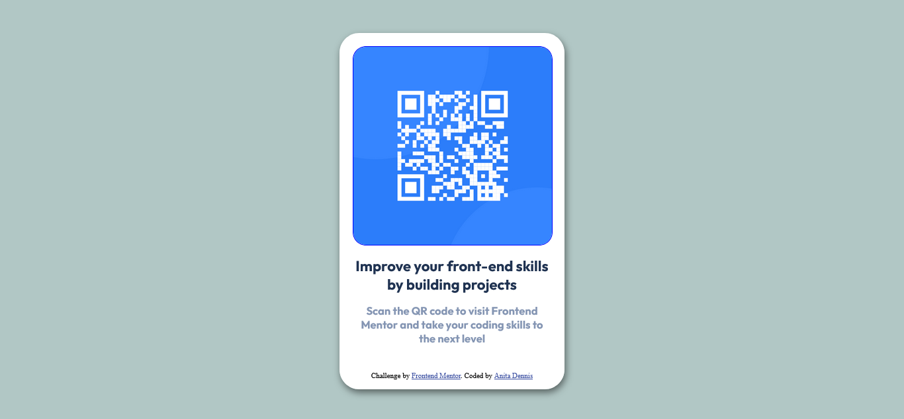

## Table of contents

- [Overview](#overview)
  - [Screenshot](#screenshot)
  - [Links](#links)
- [My process](#my-process)
  - [Built with](#built-with)
  - [What I learned](#what-i-learned)
  - [Continued development](#continued-development)
- [Author](#author)


## Overview
  Building this has been fun, took me three days to get done because im kinda new to the whole thing, shoutout to frontmentor.io for their amazing projects which not only teaches how to be a frontend developer but also what its like being a front end developer in real life. It's not much and ill have you know this is my first challenge on frontendmentor.io and im ready for other challenges. This has really helped boost my confidence in my journey into becoming a frontend developer because of how realistic it is.

### Screenshot



The screenshot of my work done XD

### Links

- Solution URL: [solution URL here](https://github.com/anitadenn/qr-code-component.git)
- Live Site URL: [live site URL here](https://anitadenn.github.io/qr-code-component/)

## My process
  I used an internal style sheet to style the qr code component by following the style guide.


### Built with

- Semantic HTML5 markup
- CSS custom properties
- google fonts


### What I learned

I learned how to use github and i didnt even know i can create a repo from my machine i thought i could only do that in github, i learned how to publish a site , i didnt even know github could publish a site XD. overall i learned how frontend developers actually work IRL, and if this is not how i should learn frontend then i won't consider even learning.

Trying out code snippets XD:

```html
<h1>I love frontendmentor.io</h1>
```


### Continued development

In the future, i want to learn css frameworks, react, and more frameworks and just become really good in frontend development.


## Author

- Frontend Mentor - [@anitadenn](https://www.frontendmentor.io/profile/anitadenn)
- github -[@anitadenn](https://www.github.com/anitadenn)


